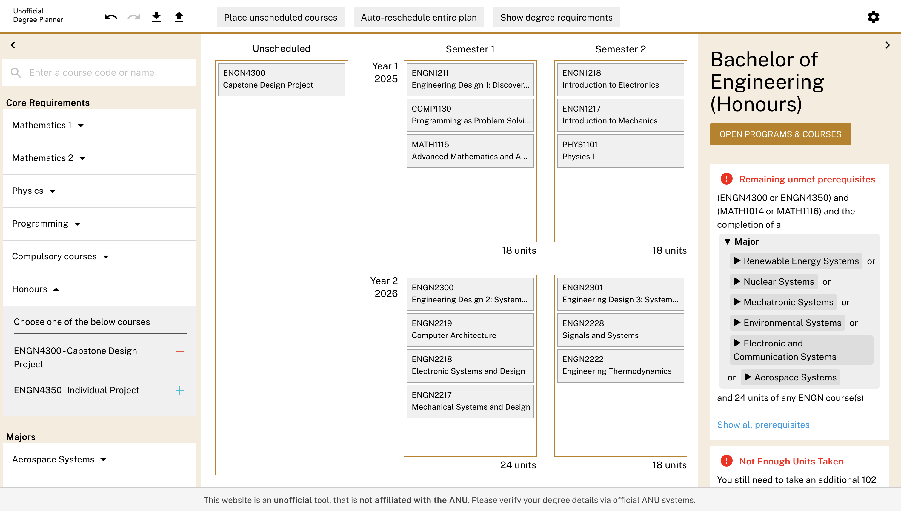

# Uni Degree Planner – Prerequisite Language Docs

This repository contains documentation for the Uni Degree Planner tool.

This tool allows students to plan out their degree using a drag-and-drop interface, while ensuring prerequisite and program requirements are correctly validated.

The tool is designed to be easily configurable for any university or school. It is currently implemented as an **unofficial** planner for the Australian National University (ANU). This tool is **not affiliated** with the ANU.

You can try the unofficial ANU planner here: **[Unofficial ANU Degree Planner](https://www.unidegreeplanner.com)**

**View the full documentation site here:**  
[https://alexdboxall.github.io/uni-degree-planner-docs/](https://alexdboxall.github.io/uni-degree-planner-docs/)

---

Built using [MkDocs](https://www.mkdocs.org/) with the [Material for MkDocs theme](https://squidfunk.github.io/mkdocs-material/).